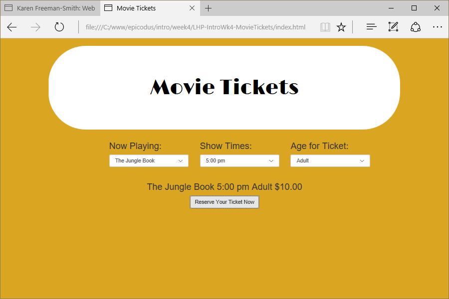

# Movie Tickets
Version 0.0.1: April 27, 2016
by [Karen Freeman-Smith](https://karenfreemansmith.github.io)

### Technologies Used
HTML, CSS, Bootstrap, JavaScript, jQuery

## Description
*[Learn How To Program](http://learnhowtoprogram.com) Intro to Programming Week 2 Individual Project: A website that calculates the price of movie tickets.*

## Setup/Installation
* [View on Github Pages](https://karenfreemansmith.github.io/LHP-IntroWk4-MovieTickets)
* _OR_
* Clone directory
* Open index.html in your favorite browser

## Support & Contact
For questions, concerns, or suggestions please email karenfreemansmith@gmail.com

## Specifications
Create a webpage where a user can select the *name of a movie*, the *time of day* that they would like to see the movie and their *age*. The webpage should let them know how much their movie ticket will cost, based on those three factors. Consider that non-"first-release" movies, matinee and senior tickets tend to be cheaper than the regular priced ticket.

Your constructor and prototype could be called Ticket and you can come up with the formula for determining how the price is calculated depending on the input from the user.

## Known Issues
* None

## Legal
*Licensed under the GNU General Public License v3.0*

Copyright (c) 2016 Copyright _[Karen Freeman-Smith](https://karenfreemansmith.github.io)_ All Rights Reserved.
